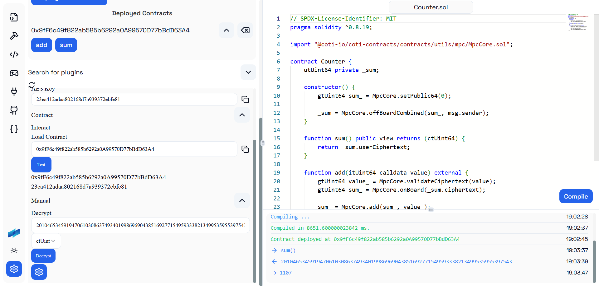

# plugin-coti-solide

The COTI Plugin for Solide enhances the Solide IDE with tools for onboarding, data encryption, and secure smart contract interactions on the COTI blockchain. It provides step-by-step onboarding assistance for setting up COTI smart contracts, built-in encryption and decryption helpers for secure data handling, and seamless integration within Solide for an optimized development experience.



## Running Locally

```bash
bun install
bun run dev
```